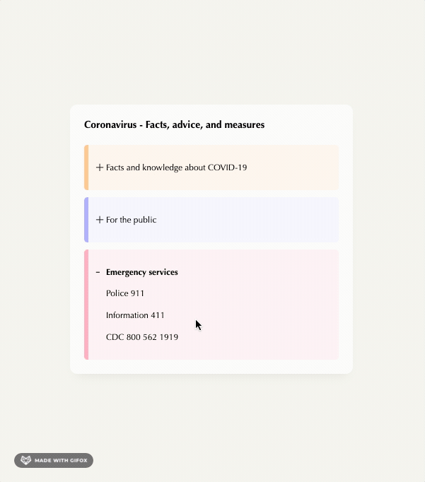

# CSS Accordion
An expanding and collapsing semi-responsive accordion built with HTML and CSS. Inspired by [this](https://www.uidesigndaily.com/posts/sketch-accordion-day-1220) 
mockup on UI Design Daily:

**Source**

**End Product**

## My Approach
My accordions are contained in an information modal that is centered both vertically and horizontally using flexbox. My accordions only reveal their headings
until they are hovered over, at which point the max-height is increased and a transition animates the accordion expansion and its body content.

### Challenges
The main challenge I faced was expanding and collapsing the accordions with CSS only. I quickly learned that, due to performance concerns, `auto` dimension values 
cannot be animated with a transition. 

After researching some possible solutions[1] I settled on transitioning the `max-height` property of the element. To make the transitions as smooth as possible, I 
couldn't just use some large arbitrary unit because the transition would continue past the intrinsic height of the content --a user would never see the transition
from beginning to end. To get around this I assigned a value to `max-height` that was as close to the full content height as possible. Since my component is 
somewhat responsive, and I couldn't always guarantee the ending height, I could not assign an exact px value. A more responsive approach would have prevented 
implementation of this specific solution.

This seems like a problem that is more easily solved with JavaScript.

#### Sources
1. https://css-tricks.com/using-css-transitions-auto-dimensions/
